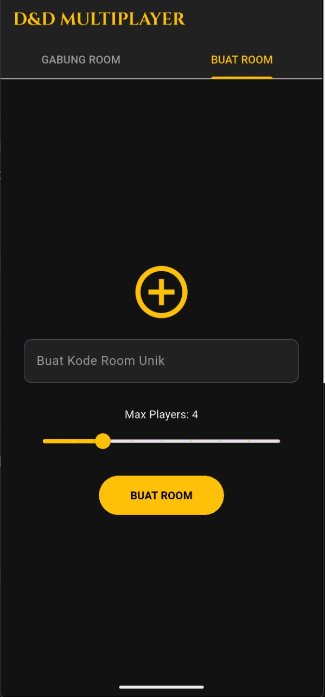
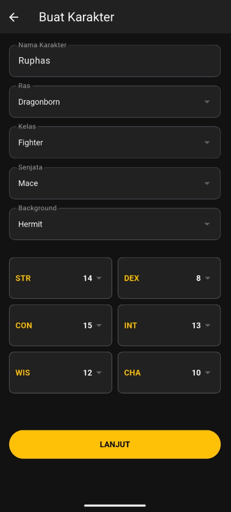
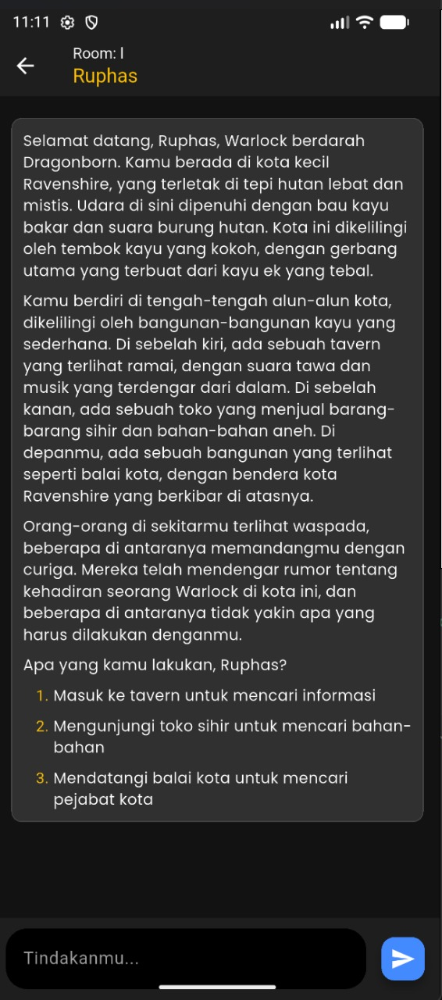
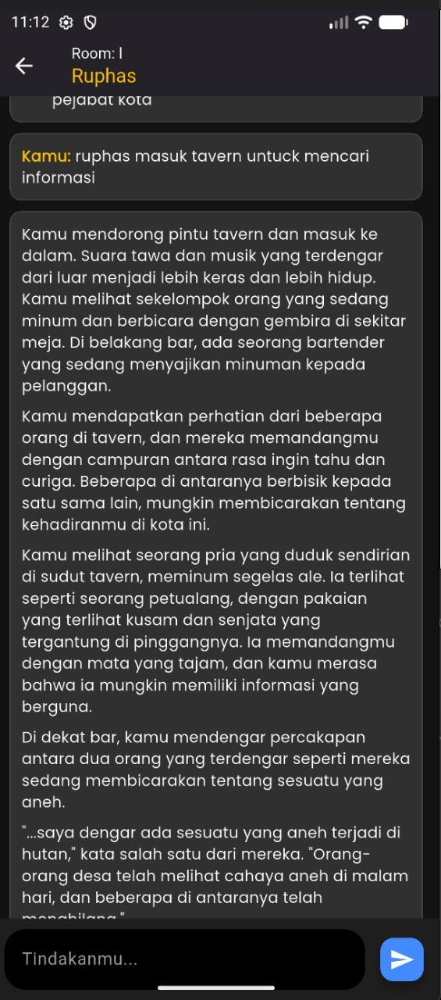

# 🐉 DND ADVENTURE AI - Multiplayer Text RPG (Node.js & Flutter)

Aplikasi game Dungeons & Dragons (D&D) 5th Edition berbasis teks yang didukung oleh AI (Groq/Llama) sebagai Dungeon Master (DM) yang ketat pada aturan. Mendukung mode **Solo** dan **Multiplayer** hingga 10 pemain.

## 🚀 Fitur Utama

| Fitur                   | Status | Deskripsi                                                            |
| :---------------------- | :----- | :------------------------------------------------------------------- |
| **AI Dungeon Master**   | ✅      | Menggunakan model Llama (via Groq) sebagai DM.                       |
| **State Machine Guard** | ✅      | Backend secara ketat memisahkan fase Opsi dan fase Roll.             |
| **Solo/Multi Mode**     | ✅      | Dapat dimainkan sendirian atau bersama teman.                        |
| **Waiting Room Sync**   | ✅      | Semua pemain harus klik "Ready" untuk memulai game bersamaan.        |
| **Character Builder**   | ✅      | Form untuk membuat Race, Class, dan Stats dengan Standard Array.     |
| **Roll System**         | ✅      | Tombol dadu muncul otomatis saat AI meminta roll `[ROLL_REQ: STAT]`. |

## 📸 Tampilan Aplikasi (Screenshots)

> **Catatan singkat:** gunakan **path relatif** (`assets/...`) di README jika file gambar sudah ada dalam repo yang sama. Jika Anda tetap ingin memakai link GitHub, gunakan **raw.githubusercontent.com** (bukan `/blob/`) atau hapus spasi pada nama file.

### Opsi A — Path relatif (direkomendasikan, bekerja untuk repo private & public)

Taruh gambar di `assets/` (atau folder yang sama dengan README), lalu gunakan sintaks:

```md
| Judul Tampilan        | Screenshot |
| :-------------------- | :--------- |
| **Lobby (Create Room)** |  |
| **Character Sheet**     |  |
| **Waiting Room Sync**   |  |
| **Chat In-Game 1**      |  |
| **Chat In-Game 2**      |  |
| **Chat In-Game 3**      |  |
```

### Opsi B — Raw GitHub URL (jika file ada di `main` branch dan repo public)

Gunakan URL `raw.githubusercontent.com` tanpa `/blob/`:

```md

```

> Contoh tabel lengkap (raw URLs):

```md
| Judul Tampilan        | Screenshot |
| :-------------------- | :--------- |
| **Lobby (Create Room)** |  |
| **Character Sheet**     |  |
| **Waiting Room Sync**   |  |
| **Chat In-Game 1**      |  |
| **Chat In-Game 2**      |  |
| **Chat In-Game 3**      |  |
```

---

## 🛠️ Panduan Setup

### A. Setup Backend (Folder `server/`)

1. **Navigasi:** Masuk ke folder `server`.

   ```bash
   cd server
   ```

2. **Instalasi Dependencies:**

   ```bash
   npm install
   ```

3. **Konfigurasi API Key (Wajib):**

   * Buat file **`.env`** di dalam `server/`.
   * Isi dengan kunci API Groq Anda:

     ```env
     GROQ_API_KEY="gsk_xxxxxxxxxxxxxxxxxxxxxxxxxxxxxx" 
     ```

4. **Jalankan Server:**

   ```bash
   node index.js
   ```

   *(Server akan berjalan di `http://localhost:3000`)*

### B. Setup Frontend (Folder `client/`)

1. **Navigasi:** Masuk ke folder `client`.

   ```bash
   cd ../client
   ```

2. **Instalasi Dependencies Flutter:**

   ```bash
   flutter pub get
   ```

3. **Jalankan Aplikasi:**

   * Pastikan IP di `client/lib/main.dart` sudah benar (`http://10.0.2.2:3000` untuk emulator).

   ```bash
   flutter run
   ```

---

## 🎲 Cara Bermain & Alur

1. **Buat Room:** Di Lobby, buat kode Room unik dan atur Max Players (minimal 1).
2. **Character Creation:** Isi detail karakter Anda (Nama, Ras, Kelas, dan sebarkan Standard Array Stats: 15, 14, 13, 12, 10, 8).
3. **Lobby Synchronization:** Masuk ke Waiting Room.

   * Jika Max Players > 1, tunggu teman Anda bergabung.
   * Tekan tombol **"SAYA SIAP (READY)"**.
4. **Game Start:** Setelah semua pemain siap (atau segera jika Solo), AI akan mengirim narasi pembuka.
5. **Rolling:** Jika AI meminta tindakan berbahaya, ia akan membalas dengan narasi dan diakhiri tag `[ROLL_REQ: STAT]`. Tombol dadu akan muncul, dan Anda harus melempar dadu sebelum melanjutkan.

---

### Catatan Penting Mengenai Error Groq (429)

Jika server Node.js menampilkan error `RateLimitError: 429` (seperti yang terjadi sebelumnya), ini berarti kuota harian Groq Anda sudah habis.

Solusi:

1. Tunggu 12-24 jam hingga kuota harian di Groq reset. **ATAU**
2. Ganti model di `index.js` dari `llama-3.3-70b-versatile` ke model yang lebih ringan dan cepat seperti **`llama-3.1-8b-instant`**.

---

## 🤝 Kontribusi

Proyek ini bersifat open source. Semua kontribusi (perbaikan bug, penambahan fitur D&D 5e, atau perbaikan UI) sangat disambut baik!
